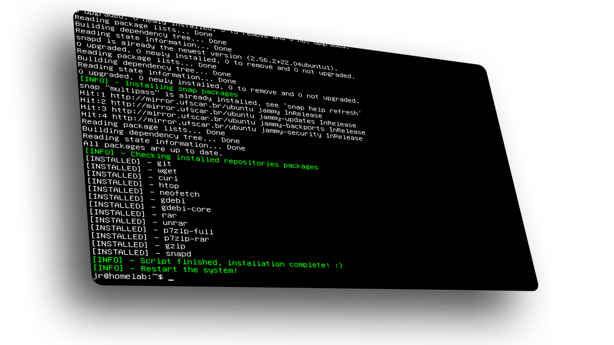

<p></p>

# ./postInstall - Personal post installation script.

<h1 align="center">
    
</h1>

This is a **post installation** shell script set up for my personal use, you can use it or edit it for your own use.
<hr>

## How to run on Linux
To get started, download the script for your system:
```bash
# wget
$ wget https://raw.githubusercontent.com/jeanrodrigop/postInstall/master/README.md

# curl
$ curl -O https://raw.githubusercontent.com/jeanrodrigop/postInstall/master/README.md
```
After the download, run the script:
```bash
# Linux Mint
$ sudo bash ./postinstall-mint.sh

# Pop-OS
$ sudo bash ./postinstall-pop-os.sh

# Ubuntu
$ sudo bash ./postinstall-ubuntu.sh

# Ubuntu Server
$ sudo bash ./postinstall-ubuntu-server.sh
```
<hr>

Build by Jean Rodrigo | Developed by <a href="https://github.com/Diolinux">Diolinux</a>
