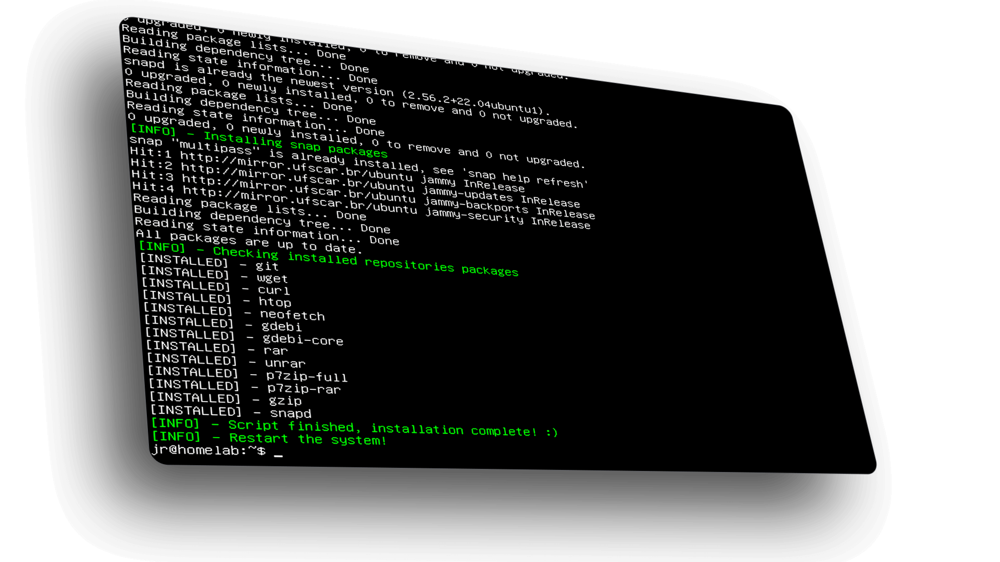

<p></p>

# ./postInstall - Personal post installation script.

<h1 align="center">
    
</h1>

This is a **post installation** shell script set up for my personal use, you can use it or edit it for your own use.
<hr>

## How to run
To get started, download the script:
```bash
# wget
$ wget https://github.com/jeanrodrigop/postInstall/archive/refs/heads/main.zip && unzip main.zip
```
Choose the directory of the installed system and change permission to execute:
```bash
# bash
$ sudo chmod +x postinstall.sh
```
Then run the script:
```bash
# bash
$ ./postinstall.sh
```
<hr>

Jean Rodrigo
