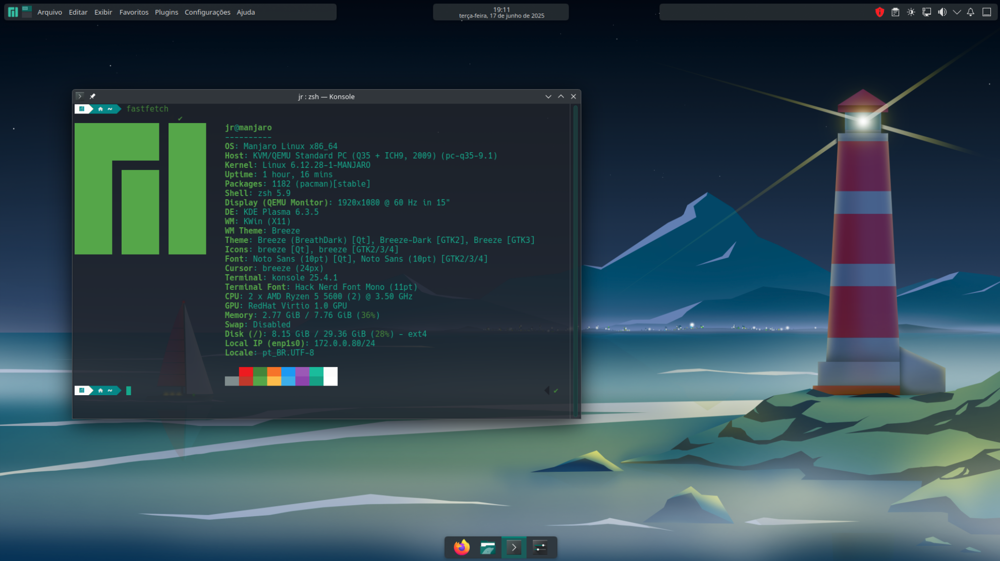

<p></p>

# Manjaro post installation script.

<h1 align="center">
    
</h1>

This is a **post installation** shell script set up for my personal use, you can use it or edit it for your own use.
<hr>

```bash
# bash
sudo chmod +x manjaro-kde.sh && ./manjaro-kde.sh
```
<hr>

Jean Rodrigo
